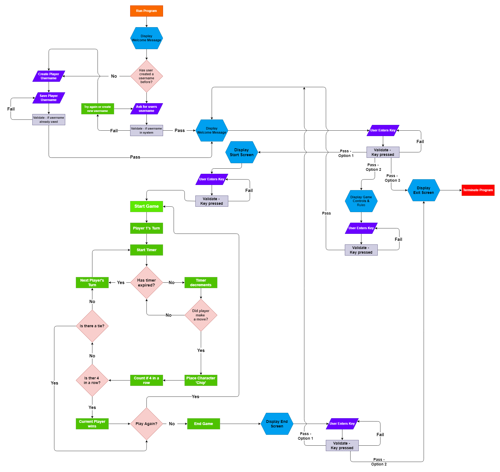

# **Connect4 Command Line Interface Game - Project Portfolio 3 - Python**

Connect4 is a Command Line Interface styled interactive game that allows 2 players to play against each other on the same device.Connect4 is based off the popular Connect4 game uses a similar concept of a connecting 4 pieces in a row to win.

You can view the live program here: <a href ='https://cli-connect-four.herokuapp.com/' target="_blank"> Connect 4 CLI game</a>

# Contents

* [Objective](<#objective>)
* [User Experience](<#user-experience-ux>)
  * [Site Aims](<#site-aims>)
  * [User Stories](<#user-stories>)
  * [Site Structure](<#site-structure>)
* [Features](<#features>)
* [Future Features](<#future-features>)
* [Technologies Used](<#technologies-used>)
* [Testing](<#testing>)
  * [Manual Testing](<#manual-testing>)
  * [Bugs Fixed](<#bugs-fixed>)
* [Deployment](<#deployment>)
* [Credits](<#credits>)
* [Acknowledgements](<#acknowledgements>)

# Objective

The aim of this project is to deliver an interactive and engaging command line interface game that is satisfying for the user to play.

[Back to top](<#contents>)

# User Experience (UX)

## Site Aims

* To provide the player with an interactive and engaging game that can be played against another player
* To create a game that encourages the player to play again
* To provide an interactive experience that is easy to navigate and understand
* To provide a clear and appropriate response to any user inputs

## User Stories

The **user** is any person who has an interest in the old school board games like Connect4, and any games that run via command line.

| ID  | ROLE |                                   ACTION                                   |                    GOAL                     |
| --- | :--- | :------------------------------------------------------------------------: | :-----------------------------------------: |
| 1   | USER |            As a user, I want to be able play the Connect4 game             |            So I can can have fun            |
| 2   | USER |    As a user, I want to be able to navigate around the interface easily    | so it doesn't take me out of the experience |
| 3   | USER | As a user, I want to see clearly from the opening screen what the game is  |        So as to avoid any confusion         |
| 4   | USER |       As a user, I want to be able to access game rules and controls       |       So I know how to play the game        |
| 5   | USER |       As a user, I want to be able to start the game when I am ready       |           So I can prepare myself           |
| 6   | USER |               As a user, I want to be able to track my wins                |           So I can improve on it            |
| 7   | USER | As a user, I want to be able to start a new game when the current one ends |   So I can see if I can beat my opponent    |

[Back to top](<#contents>)

## Flowchart - Python Logic

# Features

The Connect 4 Command Line Interface game was created to produce a retro style, immersive experience through the use of limited design (due to the nature of Python) and site structure. It has a game like structure with the use of screens and user input to navigate from one screen to another.

## Navigation

  * The programs navigation is done mainly via the use of on screen menus and user input to navigate from one screen to another
  * For the most part the menu is dictated by numbers e.g. Press 1) To Get Started ...
  * The user input is handled so as to prompt the users of the correct input needed to move to the screen of choice if an incorrect input is entered.

## Welcome Screen

  * The welcome screen is the first screen the user will see when they run the program.
  * Figlet fonts are used to create the Connect 4 title banner that displays in yellow.
  * This banner is also displayed across multiple other screens throughout the program for consistency.
  * The user is greeted by a message explaining the program and explaining how to input values
  * Through the use of print statements and user input, the user can navigate to the Get Started screen or the Rules screen.
  * The user input is validated before proceeding to the next screen.

## Game Rules

* The Game Rules screen can be accessed by the user from the Welcome Screen via user input of '2'.
* Figlet font is used to display the title banner of Game Rules in a red colour to distinguish it from the main title banner.
* A timed scolling up, line by line text goes through the rules of the game in yellow.
* The information about usernames is in a red font so as to stand out as important information.
* Once the end of the rules is reached, user input is required to move on, allowing the user to scroll back and read the rules in their own time if need be.
* Once the user input is validated the user is brought to another menu, allowing the user to choose to go back to the Welcome Screen or move ahead to the Get Started screen.
* This user input is also validated before allowing the user to move ahead.

## Create Username/Login

* The get started, one must either create a username or login and this screen can be reached via the Welcome screen and user input ('2') or the Game Rules screen and user input('2')
* The screen itself has the signature Connect 4 title banner in yellow on top.
* Player 1 always starts and is prompted via a user input on whether they would like to create a username('1') or login('2').
* This input is validated.

### Create Username
  
  * If the user decides to create a username, they are then prompted to input a username of choice.
  * This input is first converted to all capitals for consistency and to prevent two different usernames such as 'Rhi' and 'rhi' existing.
  * This also future proofs logins for users if they decide to play again, as any mistypes in terms of capitilisation are handled by converting the input to all capitals, avoiding the user potentially mistakenly logging in with someone elses username.
  * Using the .strip() method the user input for username removes any blank spaces from the beginning and the end of the input so as not to throw an error when appending to google sheets as blank space is translated differently there.
  * The user input is then validated so that:
    1. The length of the string(user input) is not empty
    2. The username itself is between 2 and 10 characters
    3. The user cannot input a username that is already saved in Google Sheets
  * Once the input passes validation, there username is saved in Google Sheets and their Total Wins and Total Loss values are set to 0.
  * The user is greeted with a personalised screen, stating their name, what player they are and what their player piece is and the string is in red for player 1 and yellow for player 2.
  * Once Player 1 has input their details, Player 2 is then brought to the same initial on screen menu as player one and if they choose to create a username as well they go through the same steps as player 1.

  ### Player Login

  * If the user decides to Login, they are then prompted to enter in their username.
  * This input is then first converted to all Capitals in case a user mistypes re capitilisation.
  * The input value is then checked against the usernames already in Google Sheets and if it is there, it will pull that players data into the game and 'log' them in.
  * If it isn't there, the user will be prompted with a message saying Cannot find username and the user can re-enter their username.
  * If Player 2 decides to log in there is an extra step; their input is validated by the above steps but it also checked against Player 1's Username.
    * If it matches the user will be prompted with a message, stating user already logged in, to prevent the same user logging in twice
    * If it doesn't match and the input value found in Google Sheets, the the player data is pulled in for that user and the player 'logged' in.
  * Once validated the username value is matched with that on google sheets and the relevant data pulled into the program; The user's Total Win history and Total Losses history to be displayed when playing the game.
  * The users are greeted with a personalised screen, the same as when a user creates a username

* Once the username data is all validated and the data pulled into the game the users are brought automatically to the next screen which is the start screen.

## Start Screen

* The start screen is only accessed in two situations; 
  1. When the users first create usernames/login
  2. Or when the users finish a game and decide to play again they are brought directly to this screen.
* The user is prompted with a message asking them if they are ready and to press 'C' to continue.
* The user input is validated and if passed, gives a countdown of 3, 2, 1 before disappearing and 'PLAY' appears on the screen and the user is brought to the game screen.

## Game Screen

* The game screen consists of 3 parts;
  1. The game bar on the top
  2. The 'Game Board' itself
  3. The text for user input and information

  ### Game Bar

  * The Game bar consists of a number of strings printed together consisting of 
  blank strings and text, with a text highlight (from termcolor and colorama libraries) on all the printed strings to give the illusion of a rectangle.
  * The bar itself has two sets of info on it;
    1. That for the current game which consists of the stats(Player 1s wins and losses and player 2s wins and losses for their game agains each other)
    2. And the history of games played of the two players(Player 1s total wins and losses from whenever the have played the game, and similarly the same for Player 2. )
  * Once a game is won, the game bar is updated immediately and visibly at the end of the game. 
  * The game bar is also utilised in the high scores screen to give the scores related to the current users as well as the verall top scores.

  ### Game Board
  
  * The game board is a representation of the classic connect 4 game, but larger.
  * It is created through various empty strings and character strings.
  * Visually it looks like a large rectangle split into columns and rows.
  * When a player piece is dropped into the board, like the classic game it fills the next available blank spot to the corresponding column picked.

  ### Player information area

  * All player input, error handling and information is printed below the game board.

* Player 1 always starts and is prompted to choose a column between 1 and 10 via user input.
* This input is validated:
  1. To check if the column is free first and if its full it lets the user know and asks them to pick a different one.
  2. To make sure the input they entered is a number and if not prompts the user to make the correct choice
  3. To make sure if the user input is a name, that its between 1 and 10 and if it isn't to prompt the user to make the correct choice. 
* If it passes the player piece (which is a unicode image of a red disc for Player 1 and a yellow disc for Plyer 2), is placed in.
* After every move, the board is checked for a 'win', if there is 4 particular characters in a row either horizontally, vertically or diagonally.
* If not the next player goes and if so the game board is updated with the new results, the players are let know who won.
* The board isn't wiped immediately allowing the user's to see the winning play.
* To move on requires the user input of 'C' to continue which is validated and if it passes the user continues on to the Play Again screen.
* A tie is also possible, and if all the spaces are filled in the board, the game finishes with the declaration of no winner and the user can continue on to the play again screen.

## Play Again

## High Scores Screen

## Quite Screen

[Back to top](<#contents>)

# Future Features

[Back to top](<#contents>)

# Technologies Used

[Back to top](<#contents>)

# Testing

[Back to top](<#contents>)

## Bugs Fixed

[Back to top](<#contents>)

# Deployment

## To fork the repository on GitHub

A copy of the GitHub Repository can be made by forking the GitHub account. Changes can be made on this copy without affecting the original repository.

1. Log in to GitHub and locate the repository in question.
2. Locate the Fork button which can be found in the top corner, right-hand side of the page, inline with the repository name.
3. Click this button to create a copy of the original repository in your GitHub Account.

## To clone the repository on GitHub

1. Click on the code button which is underneath the main tab and repository name to the right.
2. In the 'Clone with HTTPS' section, click on the clipboard icon to copy the URL.
3. Open Git Bash in your IDE of choice.
4. Change the current working directory to where you want the cloned directory to be made.
5. Type git clone, and then paste the URL copied from GitHub.
6. Press enter and the clone of your repository will be created.

[Back to top](<#contents>)

# Credits

[Back to top](<#contents>)

# Acknowledgements

[Back to top](<#contents>)
